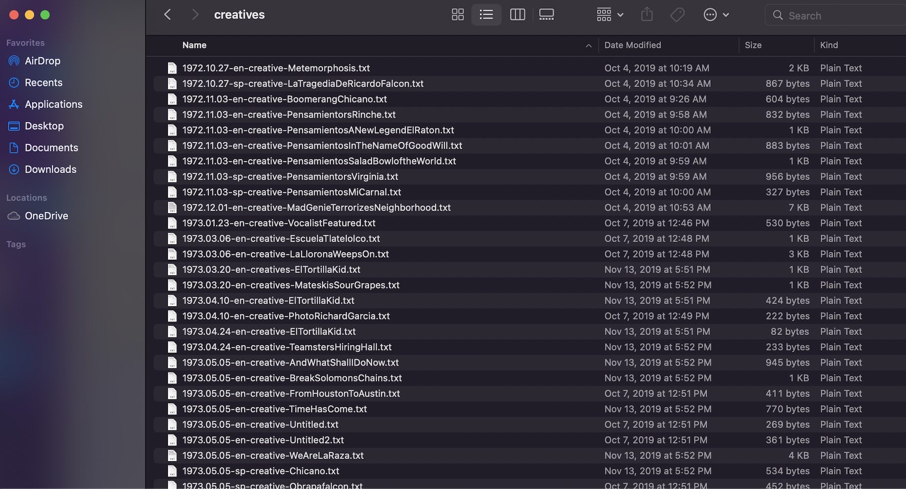

# Preliminaries: Getting Started with RStudio

In this preliminary section, we'll cover basic information that will help you to get started with RStudio.

## R and RStudio Installation

If you haven't already, please go ahead and install both the R and RStudio applications. R and RStudio must be installed separately; you should install R first, and then RStudio. The R application is a bare-bones computing environment that supports statistical computing using the R programming language; RStudio is a visually appealing, feature-rich, and user-friendly interface that allows users to interact with this environment in an intuitive way. Once you have both applications installed, you don't need to open up R and RStudio separately; you only need to open and interact with RStudio (which will run R in the background). 

The following subsections provide instructions on installing R and RStudio for the macOS and Windows operating systems. These instructions are taken from the "Setup" section of the Data Carpentry Course entitled [*R for Social Scientists*](https://datacarpentry.org/r-socialsci/setup.html). The Data Carpentry page also contains installation instructions for the Linux operating system; if you're a Linux user, please refer to that page for instructions. 

The Appendix to Garret Grolemund's book *Hands on Programming with R* also provides an [excellent overview of the R and RStudio installation process](https://rstudio-education.github.io/hopr/). 

### Windows Installation Instructions

+ Download R from the [CRAN website](https://cran.r-project.org/bin/windows/base/)
+ Run the ```.exe``` file that was just downloaded.
+ Go to the [RStudio download page](https://www.rstudio.com/products/rstudio/download/#download) and under *Installers* select the "Windows" option.
+ Double click the file to install RStudio
+ Open RStudio to make sure it works. 

### macOS Installation Instructions

+ Download R from the [CRAN website](https://cran.r-project.org/bin/macosx/)
+ Select the ```.pkg``` file for the latest R version.
+ Double click on the downloaded file to install R.
+ It is also a good idea to install [XQuartz](https://www.xquartz.org/), which some packages require.
+ Go to the [RStudio download page](https://www.rstudio.com/products/rstudio/download/#download), and under *Installers* select the "macOS" option.
+ Double click the file to install RStudio
+ Open RStudio to make sure it works. 

## The RStudio Interface 

Now that we've installed and opened up RStudio, let's familiarize ourselves with the RStudio interface. When we open up RStudio, we'll see a window that looks something like this:

```{r, echo=FALSE, results='asis', out.width='100%', fig.cap='The RStudio Interface', fig.alt='RStudio Interface Open on Desktop'}
knitr::include_graphics('pictures/rstudio_window_revised.png')
```

If your interface doesn't look exactly like this, it shouldn't be a problem; we would expect to see minor cosmetic differences in the appearance of the interface across operating systems and computers (based on how they're configured). However, you should see four distinct windows within the larger RStudio interface:

- The **top-left** window is known as the *Source* window. 
  - The *Source* window is where we can write our R scripts (including the code associated with this tutorial), and execute those scripts. We can also type in R code into the "Console" window (bottom-left window), but it is preferable to write our code in a script within the source window. That's because scripts can be saved (while code written into the console cannot); writing scripts therefore allows us to keep track of what we're doing, and facilitates the reproducibility of our work. Note that in some cases, we may not see a *Source* window when we first open RStudio. In that case, to start a new script, simply click the ```File``` button on the RStudio menu bar, scroll down to ```New File``` button, and then select ```R Script``` from the menu bar that opens up.
  - It's also worth noting that the outputs of certain functions will appear in the *Source* window. In the context of our tutorial, when we want to view our datasets, we will use the ```View()``` function, which will display the relevant data within a new tab in the *Source* window. 
- The **top-right** window is the *Environment/History* pane of the RStudio interface. 
  - The "Environment" tab of this window provides information on the datasets we've loaded into RStudio, as well as objects we have defined (we'll talk about objects more later in the tutorial). 
  -The "History" tab of the window provides a record of the R commands we've run in a given session. 
- The **bottom-right** window is the *Files/Plots/Packages/Help/Viewer* window. 
  - The "Files" tab displays our computer's directories and file structures and allows us to navigate through them without having to leave the R environment. 
  - The "Plots" tab is the tab where we can view any visualizations that we create. Within the "Plots" tab, make note of the "Zoom" button, which we can use to enlarge the display of our visualizations if they're too compressed in the "Plots" window. Also, note the "Export" button within the "Plots" tab (next to the "Zoom" button); we can use this button to export the displayed visualization to a .png or .jpeg file that can be used outside of RStudio. 
  - The "Packages" tab provides information on which packages have been installed, as well as which packages are currently loaded (more on packages in Sections 2.3 and 2.4 below)
  - The "Help" tab displays documentation for R packages and functions. If you want to know more about how a package or function work, we can simply type a "?" followed by the package or function's name (no space between the question mark and the name) and relevant information will be displayed within the "Help" tab. 
  - The "Viewer" tab displays HTML output. If we write code that generates an HTML file, we can view it within the "Viewer" tab.
- The **bottom-left** window is the *Console/Terminal/Jobs* window. 
  - The "Console" tab is where we can see our code execute when we run our scripts, as well as certain outputs produced by those scripts. In addition, if there are any error or warning messages, they will be printed to the "Console" tab. We can also type code directly into the console, but as we noted earlier, it is better practice to write our code in a script and then run it from there. 
  - The "Terminal", "R Markdown" and "Jobs" tabs  are not relevant for our workshop.  

## Install Packages 

R is an open-source programming language for statistical computing that allows users to carry out a wide range of data analysis and visualization tasks (among other things). One of the big advantages of using R is that it has a very large user community among social scientists, statisticians, and digital humanists, who frequently publish R packages. One might think of packages as workbooks of sorts, which contain a well-integrated set of R functions, scripts, data, and documentation; these "workbooks" are designed to facilitate certain tasks or implement useful procedures. These packages are then shared with the broader R user community, and at this point, anyone who needs to accomplish the tasks to which the package addresses itself can use the package in the context of their own projects. The ability to use published packages considerably simplifies the work of digital humanists using R; it means that they rarely have to write code entirely from scratch, and can build on the code that others have published in the form of packages. This allows applied researchers to focus on substantive problems, without having to get too bogged down in complicated programming tasks. 

In the context of this tutorial, extracting even basic information from a text corpus in R would be a relatively complex task if we had to write all our code from scratch. However, because we are able to make use of text mining and visualization packages written by other researchers and programmers, the task is considerably simpler, and will not require any complicated programming. 

In this workshop, we will use the following packages to carry out some basic text mining and data visualization tasks (please click the relevant link to learn more about a given package; note that the tidyverse is not a single package, but rather an entire suite of packages used for common data science and analysis tasks): 

+ [*tm*](https://cran.r-project.org/web/packages/tm/vignettes/tm.pdf)
+ [*tidyverse*](https://www.tidyverse.org): 
+ [*wordcloud2*](https://cran.r-project.org/web/packages/wordcloud2/vignettes/wordcloud.html)
+ [*quanteda*](https://quanteda.io)
+ [*tidytext*](https://cran.r-project.org/web/packages/tidytext/vignettes/tidytext.html)

To install a package in R, we can use the ```install.packages()``` function. A function is essentially a programming construct that takes a specified input, runs this input (called an "argument") through a set of procedures, and returns an output. In the code block below, the name of the package we want to install (here, "tm") is enclosed within quotation marks and placed within parentheses after printing ```install.packages``` Running the code below will effectively download the *tm* package to our computer:

```{r, eval=FALSE}
# Installs "tm" package
install.packages("tm")
```

To run this code in your own R session:

* First, copy the code from the codeblock above (you can copy the code to your clipboard by hovering over the top-right of the code-block and clicking the "copy" icon; you can also highlight the code and copy from the ```Edit``` menu of your browser). 
* Then, start a new R script within RStudio; if you want to keep a future record of your work, you may want to save this script to your computer (perhaps in the same folder to which you downloaded the tutorial data). We can save our scripts via the RStudio "File" menu.
* Paste the code into the script, highlight it, and click the "Run" button that is just above the *Source* window.
* Alternatively, instead of copying/pasting, you can manually type in the code from the codeblock into your script (manually typing in the code is slower, but often a better way to learn than copy/pasting). 
* After you've run the code, watch the code execute in the console, and look for a message confirming that the package has been successfully installed. 

Below, we can see how that line of code should look in your script, and how to run it:

```{r, echo=FALSE, results='asis', out.width='100%', fig.cap='Installing tm package in R Script'}
knitr::include_graphics('pictures/install_package.png')
```

Please note that you can follow along with the tutorial on your own computers by transferring all of the subsequent codeblocks into your script in just this way. Run each codeblock in your RStudio environment as you go, and you should be able to replicate the entire tutorial on your computer. You can copy-paste the workshop code if you wish, but we recommend actually retyping the code into your script, since this will help you to more effectively familiarize yourself with the process of writing code in R.

Note that the codeblocks in the tutorial usually have a comment, prefaced by a hash ("#"). When writing code in R (or any other command-line interface) it is good practice to preface one's code with brief comments that describe what a block of code is doing. Writing these comments can allow someone else (or your future self) to read and quickly understand the code more easily than otherwise might be the case. The hash before the comment effectively tells R that the subsequent text is a comment, and should be ignored when running a script. If one does not preface the comment with a hash, R wouldn't know to ignore the comment, and would throw an error message.

Now, let's install the other packages we mentioned above, using the same ```install.packages()``` function: 

```{r, eval=F}
install.packages("tidyverse")
install.packages("wordcloud2")
install.packages("quanteda")
install.packages("tidytext")
```

All of the packages we need are now installed!

## Load libraries

However, while our packages are installed, they are not yet ready to use. Before we can use our packages, we must load them into our environment. We can think of the process of loading installed packages into a current R environment as analogous to opening up an application on your phone or computer after it has been installed (even after an application has been installed, you can't use it until you open it!). To load (i.e. "open") an R package, we pass the name of the package we want to load as an argument to the ```library()``` function. For example, if we want to load the *tm* package into the current environment, we can type:

```{r, eval=F}
# Loads tm package into memory
library(tm)
```

At this point, the full suite of the *tm* package's functionality is available for us to use. 

Now, let's go ahead and load the remainder of the packages that we'll need:

```{r, eval=F}
# loads remainder of required packages
library(tidyverse)
library(wordcloud2)
library(quanteda)
library(tidytext)
```

At this point, the packages are loaded and ready to go! One important thing to note regarding the installation and loading of packages is that we only have to install packages once; after a package is installed, there is no need to subsequently reinstall it. However, we must load the packages we need (using the ```library``` function) every time we open a new R session. In other words, if we were to close RStudio at this point and open it up later, we would **not** need to install these packages again, but **would** need to load the packages again.  


```{r, echo=F, warning=F, message=F}
library(tm)
library(tidyverse)
library(wordcloud2)
library(quanteda)
library(tidytext)
library(DT) 
```

## Set working directory 

Before we can bring our workshop data into RStudio and begin the tutorial, we have to specify that data's location on our computer. This step is known as setting one's working directory. First, make sure that you've downloaded the Diario text data, and have placed it in a directory (i.e. folder) on your computer that is specifically dedicated to this tutorial. To complete the workshop tasks, you will want to set your working directory to the "creatives" subdirectory within the main "2019.11.14-ElDiarioCorpus" directory that you downloaded. 

If you're unfamiliar with the concept of file paths, the easiest way to set your working directory is through the RStudio menu. To use this option, follow these steps: 

+ First, Click on the "Session" menu on the RStudio menu bar at the top of your screen, and then scroll down to the "Set Working Directory" button in the menu that opens up. 
+ When you hover over the "Set Working Directory" button, a subsidiary menu that contains a button that says "Choose Directory" will open; click this "Choose Directory" button. 
+ In the dialog box that opens up, navigate to the "creatives" subdirectory within the "2019.11.14-ElDiarioCorpus" folder, select it, and click "Open". At this point, your working directory should be set!

The graphic below demonstrates the process of setting one's working directory through RStudio's menus: 

```{r, echo=FALSE, results='asis', out.width='100%', fig.cap='Setting Working Directory Via Menus'}
knitr::include_graphics('pictures/setting_wd_revised.png')
```

**Alternatively**, if you are familiar with the concept of file paths, and know the file path to the folder containing the downloaded El Diario "creatives" text files, you can directly set the working directory using the ```setwd()``` function, where the argument to the function is the relevant file path enclosed in quotation marks. For example, the following code sets the working directory to the folder containing the creatives from the El Diario corpus: 

```{r, eval=F}
# Sets working directory 
setwd("019.11.14-ElDiarioCorpus/creatives")
```

Note that you won't want to copy and paste the above codeblock, since your file path may be different; be sure to replace the file path above with your own. 

# Reading in a Text Corpus

The first step when working with text data in RStudio is to load the data which you wish to analyze into your R environment.

Sometimes, you may only need to analyze the text within a single document, but often, you will want to analyze an entire collection of text documents (known as a corpus). In our case, we want to analyze a corpus comprised of text documents that are part of the "creatives" section of the broader "El Diario" text collection.

To make this more concrete, we can take a look at these "creatives" files on our local computer's directory:

```{r, echo=FALSE, results='asis', out.width='100%', fig.cap='Creatives text files stored in local directory'}

```

Our first job is to load all of the individual text files within this "creatives" directory into RStudio as a corpus. To do so, we will first read in all of the file names for the text documents that constitute the "creatives" corpus, and store these names within a character vector; a "vector" in R is simply a sequence of elements, and in the case of a character vector, those elements are text strings. 

The code below first reads in the file names from the "creatives" directory, using ```list.files(pattern=".txt")```. The ```list.files()``` function produces a character vector of files within a specified directory (if no directory is specified, as is the case here, it defaults to extracting the names of files from the working directory), and the argument to this function, ```pattern=".txt"```, specifies what type of files we want the ```list.files()``` function to extract (anything with a ".txt" extension). Finally, it assigns this vector of file names to a new object named ```diario_files```:

```{r, echo=-1}
setwd("2019.11.14-ElDiarioCorpus/creatives")
# reads in the filenames for diario creatives as a character vector, and 
# assigns it to an object named "diario_files"
diario_files<-list.files(pattern=".txt")
```

The concept of object assignment, which we alluded to above, is a fundamental concept when working in a scripting environment; indeed, the ability to easily assign values to objects is what allows us to easily and intuitively manipulate and process our data in a programmatic setting. To better understand the mechanics of object assignment, let's briefly step away from our text data, and consider a simple example:

```{r}
# assign value 5 to new object named x
x<-5
```

In the code above, we use R's assignment operator, ```<-```, to assign the value 5 to an object named ```x```. Now that an object named ```x``` has been created and assigned the value 5, printing ```x``` in our console (or printing ```x``` in our script and running it) will return the value that has been assigned to the ```x``` object, i.e. 5: 

```{r}
# prints value assigned to "x"
x
```

More generally, the process of assignment effectively equates the output created by the code on the right side of the assignment operator (```<-```) to an object with a name that is specified on the left side of the assignment operator. Whenever we want to look at the contents of an object (i.e. the output created by the code to the right side of the assignment operator), we simply print the name of the object in the R console (or print the name and run it within a script). 

While the example above was very simple, we can assign virtually any R code, and by extension, the data structure(s) generated by that code (such as datasets, vectors, graphs/plots etc.) to an R object. Above, we assigned the vector of text file names created by ```list.files(pattern=".txt")``` to an object named ```diario_files```, and can now confirm that this vector is associated with the ```diario_files``` object by printing the object name:

```{r}
# prints contents of "diario_files" vector
diario_files
```

We will use this basic principle of object assignment throughout the lesson.

Now, let's use this vector of file names to create a corpus object that contains the text from all of these files. To do so, we'll use the *tm* package's ```Corpus()``` function. Below, the first argument to the ```Corpus()``` function, ```URISource(diario_files)```, specifies the file names of the text documents from which we want to create our corpus. The second argument, ```readerControl=list(reader=readPlain))```, specifies that we want the ```Corpus()``` function to use a plain text reader ("readPlain") to read in the text data within the documents specified in ```diario_files``` (if our files were in a different file format, such as PDF, we would use a different reader that is appropriate to that file format). Finally, we assign the corpus to a new object named ```diario_creatives_corpus```:

```{r, echo=-1}
setwd("2019.11.14-ElDiarioCorpus/creatives")
# Uses the "Corpus" function from the "tm" package to create a new text corpus 
# based on the diario creatives text files; this corpus is assigned to a new 
# object named "diario_creatives_corpus"
diario_creatives_corpus<-Corpus(URISource(diario_files), readerControl = list(reader=readPlain))
```

If we print the name of our corpus object into the console (or run it from a script), we can return some basic metadata about the corpus we've just created:

```{r}
# prints metadata about the corpus assigned to the "diario_creatives_corpus" object
diario_creatives_corpus
```

# Creating a tidy dataframe from a text corpus

Once we have created a text corpus out of the relevant collection of text documents in our directory, we can work directly with this corpus to extract information about the contents of our text collection. However, *tm* package corpus objects can sometimes be a bit unwieldy and non-intuitive to work with. Luckily, the *tidytext* package's ```tidy()``` function can quickly transform a *tm* corpus object into a more tractable data frame (i.e. a tabular dataset), in which each text document is assigned its own row, and the entirety of the text associated with each document is stored in a column. Below, we take our corpus object, ```diario_creatives_corpus```, and pass it as an argument to the ```tidy()``` function; then, we assign the resulting data frame of textual information to a new object named ```diario_creatives_tidy```:

```{r}
# Uses the "tidy" function from the "tidytext" package to transform the 
# "diario_creatives_corpus" corpus into a tidy data frame, where each text file
# is associated with a row in the data frame; this data frame is 
# assigned to a new object named "diario_creatives_tidy"
diario_creatives_tidy<-tidy(diario_creatives_corpus)
```

Now, let's inspect the ```diario_creatives_tidy``` data frame. One way to explore the contents of a data frame object is to simply print the name of the object in the console (or run it in a script); a truncated version of the dataset will then print to the console:

```{r}
# prints contents of "diario_creatives_tidy" to console
diario_creatives_tidy
```

A better option, however, is to view data frame objects in the RStudio data viewer; this allows you to view the entire dataset, with formatting applied to make the information easier to interpret. To view ```diario_creatives_tidy``` in the RStudio Data Viewer, simply pass it as an argument to the ```View()``` function, as below: 

```{r, echo=F}
tidy_diario_head<-head(diario_creatives_tidy, 25)
```

```{r, eval=F}
# Opens "diario_creatives_tidy" in RStudio data viewer
View(diario_creatives_tidy)
```

```{r, echo=F}
tidy_diario_head %>% datatable(extensions=c("Scroller", "FixedColumns"), options = list(
  deferRender = TRUE,
  scrollY = 350,
  scrollX = 350,
  dom = "t",
  scroller = TRUE,
  fixedColumns = list(leftColumns = 1)
))
```

*Please note that data frames which are reproduced in this tutorial are sometimes truncated, to preserve memory and space; you will therefore usually see fewer rows in data frames within the tutorial material than you will see when inspecting those same data frames within the RStudio data viewer on your computers*

As we noted above, each text document is associated with a unique row. There are several columns that provide metadata associated with the corresponding text document. Most importantly, there is a column named "text" which contains the full text that is contained in the document associated with the corresponding row. 

Once we have recast our text corpus into a concise and well-structured data frame, we can begin to extract information of interest from our text data. 

# Creating a word frequency table

A common task in basic text analysis is to identify the frequency with which various words occur in a text collection, and present this information in a table (commonly referred to as a word frequency table). In this section, we will learn how to transform a tidy text dataframe such as ```diario_creatives_tidy``` into a word frequency table. 

## Tokenize ```diario_creatives_tidy```

The first step in creating a word frequency table is to split our column containing the relevant text ("text" in ```diario_creatives_tidy```) into word tokens; in the context of text analysis, a "token" is the semantic unit of analysis that you wish to use for information extraction purposes. Here, we want to tokenize by single words, since that is the unit of analysis that makes sense when the end-goal is a word frequency table. In other words, because our desired unit of analysis is a single word, we will use single words as our token. 

In the code below, we first take our existing ```diario_creatives_tidy``` data frame, and then use the ```unnest_tokens()``` function from the *tidytext* package to tokenize the information in the "text" column of ```diario_creatives_tidy``` by word, and return a new data frame where the textual unit of analysis is the word. Note that the ```unnest_tokens()``` function takes three arguments, described below:

* The first, ```input=text```, specifies the name of the column in ```diario_creatives_tidy``` that contains the text data we wish to tokenize; here, the name of this desired input column is "text". 
* The second argument, ```token="words"```, specifies that we wish to tokenize the text data in the "text" column at the level of the individual word. 
* Finally, the argument ```output=word``` specifies that the name of the column containing the word data in the new one-token-per-row dataset is to be "word."

We'll assign the new one-token-per-row dataset that results from the tokenization process to a new object named ```diario_word_tokenized```:

```{r, warning=F, message=F}
# Tokenizes "diario_creatives_tidy" by word and assigns the resulting dataset to 
# "diario_word_tokenized"
diario_word_tokenized<-
  diario_creatives_tidy %>% # declares dataset with relevant text
    unnest_tokens(input=text, # specifies name of input column containing text data
                  token="words", # specifies how to tokenize input column
                  output=word)  # specifies name of output column containing tokens
```

Now, go ahead and take a look at the newly tokenized dataset, ```diario_word_tokenized```, within the RStudio data viewer:

```{r}
# opens "diario_word_tokenized" in RStudio data viewer
View(diario_word_tokenized)
```

```{r, echo=F}
diario_word_tokenized_head<-head(diario_word_tokenized, 50)
```

```{r, echo=F}
diario_word_tokenized_head %>% datatable(extensions=c("Scroller", "FixedColumns"), options = list(
  deferRender = TRUE,
  scrollY = 350,
  scrollX = 350,
  dom = "t",
  scroller = TRUE,
  fixedColumns = list(leftColumns = 1)
))
```
\
One feature of the code used to generate a tokenized dataset may require additional elaboration. In particular, the code above uses a "pipe", a symbol that looks like this: ```%>%```. The pipe operator essentially takes whatever is to its left, and then uses it as an input to the code on its right. More specifically, in the code above, the operations on the right of the ```%>%``` are applied to the object on the left of the ``` %>%```. In other words, the pipe operator links the code on its two sides, and establishes that the dataset to be tokenized in the manner specified by the code on its right is  ```diario_creatives_tidy```.

## Extract the first draft of a word frequency table based from the tokenized dataset

Now that we have tokenized our text collection by word, and organized this information in a word-level dataset (```diario_word_tokenized```), let's use it to create the first draft of a word frequency table. To do so, we will use the ```count()``` function on the ```diario_word_tokenized``` dataset we created above. The ```count()``` function is part of the *dplyr* package, which contains extremely useful functions for data wrangling tasks; *dplyr* is one package within the broader suite of *tidyverse* packages. 

In the code below, we take our tokenized dataset, ```diario_word_tokenized```, and then call the ```count()``` function; the first argument to ```count()```, which is ```word```, specifies the name of the column which contains the values (i.e. words) whose frequencies we'd like to count up (here, the name of that column is "word"). The second argument, ```sort=TRUE```, specifies that the frequency table generated by the ```count()``` function should array the words in descending order of frequency. We'll assign the resulting dataset, which will contain information on the number of times each distinct word appears in the text collection (stored in a column named "n"), to a new object named ```diario_frequency_table```:

```{r}
# Uses "count" function to generate a dataset that contains information on the 
# frequency of each word in "diario_word_tokenized"; assigns this newly created 
# dataset (organized in descending order) to object named 
# "diario_frequency_table"
diario_frequency_table<-diario_word_tokenized %>% 
                          count(word, sort=TRUE)
```

Go ahead and view the newly created frequency table, ```diario_frequency_table```, in the RStudio data viewer:

```{r}
View(diario_frequency_table)
```

```{r, echo=F}
diario_frequency_table_head<-head(diario_frequency_table, 50)
```

```{r, echo=F}
diario_frequency_table_head %>% datatable(extensions=c("Scroller", "FixedColumns"), options = list(
  deferRender = TRUE,
  scrollY = 350,
  scrollX = 350,
  dom = "t",
  scroller = TRUE,
  fixedColumns = list(leftColumns = 1)
))
```

We now have a word frequency table! The words which appear in the text collection are contained in the column on the left ("word"), and the frequency of each word is contained in the column on the right ("n").

## Clean the word frequency table

Having generated this basic word frequency table, it is now time to edit and clean it, so as to ensure that it contains meaningful information. 

### Remove stopwords

One issue with our frequency table (```diario_frequency_table```) that you may have noticed is that many of the words are (predictably enough) common words that don't really inform us about the distinctive semantic features of the "creatives" text collection. For example, the word "the" appears 857 times in our collection, but for most research projects, this would be completely uninteresting, and may even obscure more interesting patterns within the text collection. When working with text data, it is therefore common practice to excise these common words (known as "stopwords") from a dataset of interest, before carrying out any further analysis or visualization tasks. 

Let's now go ahead and excise stopwords from ```diario_frequency_table```. In order to remove stopwords, we must first compile those words, and assemble them in an R data structure (such as a data frame or vector). This can be a tedious task, but luckily, many text mining and analysis packages provide pre-assembled collections of stopwords that we can use off the shelf, without having to develop our own from scratch. 

Within the *tidytext* package, stopwords are contained in a data frame that is assigned to an object named ```stop_words```. We can preview some of these words by printing the contents of ```stop_words``` to the console:

```{r}
# prints contents of "stop_words"
stop_words
```

Alternatively, if you want to see all of the stopwords within ```stop_words```, you can view it within the RStudio data viewer (i.e. ```View(stop_words)```).

Because our text documents also contain a meaningful amount of Spanish, it makes sense to also remove Spanish language stopwords. The ```stop_words``` data frame from the *tidytext* package only contains English stopwords, but the *tm* package allows users to extract Spanish stopwords by passing the string ```"spanish"``` to its ```stopwords()``` function. Below, we extract Spanish stopwords from the *tm* package's ```stopwords()``` function as a data frame (by passing ```stopwords("spanish")``` as an argument to the ```as.data.frame()``` function), and assign it to a new object named ```spanish_stopwords```:

```{r}
# extract Spanish stopwords as a data frame, and assign it to an object named 
# "spanish_stopwords"
spanish_stopwords<-as.data.frame(stopwords("spanish"))
```

Feel free to  view ```spanish_stopwords``` within the data viewer by passing it as an argument to the ```View()``` function (i.e. ```View(spanish_stopwords)```). Note that the column containing the stopwords is named ```stopwords("spanish")```.

Now that we have a set of English stopwords (```stop_words```), and a set of Spanish stopwords (```spanish_stopwords```), let's remove these stopwords from our word frequency table (```diario_frequency_table```): 

```{r}
# Takes the existing "diario_frequency_table" dataset, and removes English 
# and Spanish stopwords from it
diario_frequency_table<-
  diario_frequency_table %>% 
    filter(!word %in% stop_words$word) %>% # removes English stopwords
    filter(!word %in% spanish_stopwords$`stopwords("spanish")`) # removes Spanish stopwords
```

Let's unpack the code in the previous codeblock: 

* The first element (to the right of the assignment operator), is the name of the object from which we'd like to remove the relevant stopwords, ```diario_frequency_table```. 
* After declaring the name of the object we'd like to modify, we use a ```%>%``` to connect this object to the subsequent line of code, which removes the English stopwords using ```  filter(!word %in% stop_words$word)```. The ```filter()``` function (which is part of the *dplyr* package), is used to create a subset of an existing dataset, in which all of the rows that satisfy a condition (or set of conditions) are retained (and those which do not satisfy the condition(s) are discarded).  Here, the argument to the ```filter()``` function, which reads ```!word %in% stop_words$word```, can be interpreted as specifying that we wish to subset and retain all of the rows in ```diario_frequency_table``` in which the "word" column (within ```diario_frequency_table```) is NOT equal to any of the words in the "word" column of ```stop_words``` (note that in order to refer to a column from a dataset, we can type the name of the data frame object, followed by a ```$```, followed by the name of the column within the data frame). This procedure effectively excises the English stopwords from ```diario_frequency_table```. The ```!``` before ```word``` is a small detail, but important; the exclamation mark is a symbol for logical negation, and without it, the ```filter()``` function would instead subset and retain all of the rows in ```diario_frequency_table``` where the word in the "word" column *is* an English stopword. 
* After excising all of the English stopwords from ```diario_frequency_table```, we use another pipe (```%>%```), to indicate that we want to implement additional changes to ```diario_frequency_table```. We then use the ```filter()``` function to remove Spanish stopwords from ```diario_frequency_table```, with ```filter(!word %in% spanish_stopwords$`stopwords("spanish")`)```. The logic behind this expression is the same as the logic behind the previous expression, which removed English stopwords from the frequency table. That is, the argument to the ```filter()``` function specifies that we want to subset and retain all of the rows in ```diario_frequency_table``` for which the "word" column is NOT one of the Spanish stopwords contained in the ```stopwords("spanish")``` column within the ```spanish_stopwords``` dataset. This effectively removes the words in ```spanish_stopwords``` from ```diario_frequency_table```. 
* Finally, we assign the changes we made to ```diario_frequency_table``` (i.e. removing stopwords) back to the existing ```diario_frequency_table``` object with the assignment operator (```<-```) instead of creating a new object; this effectively updates the contents of ```diario_frequency_table```. Before, this data object included the stopwords in ```stop_words``` and ```spanish_stopwords```; now, after assigning the changes back to the existing object, ```diario_frequency_table``` no longer contains these stopwords. 

You can confirm that the stopwords have been removed by viewing our updated ```diario_frequency_table``` object within the RStudio data viewer. 

### Remove numbers

You may have noticed that some of the "words" in ```diario_frequency_table``` are actually numbers. In certain situations, this may be acceptable or desirable, but in other cases, you may want to remove numbers from your word frequency table. In this sub-section, we'll learn one way to do this. 

The first step is to parse each row in the "word" column of ```diario_frequency_table```, and extract the content in the "word" column if it is a number, and return an "NA" value if there are no numbers in the text; this information can be stored as a vector. The code below uses the ```parse_number()``` function to generate such a vector, and assigns this vector to a new object named ```diario_frequency_table_numbers```:

```{r, message=F, warning=F}
# defines a vector that extracts numbers from the "word" column in 
# "diario_frequency_table" and assigns it to a new vector object named 
# "diario_frequency_table_numbers"
diario_frequency_table_numbers<-parse_number(diario_frequency_table$word)
```

Next, we'll add this vector as a column in ```diario_frequency_table``` by using the ```cbind()``` function, which is used to bind a vector to a dataset as a column. Below, the first argument to ```cbind()``` is the name of the dataset to which we want to bind the vector (```diario_frequency_table```), and the second argument is the name of the desired vector (```diario_frequency_table_numbers```). We'll assign the resulting dataset (i.e.  ```diario_frequency_table``` with the  ```diario_frequency_table_numbers``` vector added to it as a column) back to ```diario_frequency_table```, which will update the existing ```diario_frequency_table``` object with this new column:  

```{r}
# updates the existing "diario_frequency_table" data frame by binding the
# "diario_frequency_table_numbers" vector to it
diario_frequency_table<-cbind(diario_frequency_table, diario_frequency_table_numbers)
```

In the updated ```diario_frequency_table```, we now have a new column (```diario_frequency_table_numbers```) which contains any numbers from the corresponding "word" column on the same row, and an "NA" value if there are no numbers in the corresponding "word" column. You can confirm this by viewing ```diario_frequency_table``` in the RStudio data viewer. 

Now that we have a new column that contains "NA" values when the corresponding word in the "word" column does NOT include numbers, we can use the ```filter()``` function to create a subset of the existing ```diario_frequency_table``` for which the value of the "diario_frequency_table_numbers" column is "NA"; this effectively excises all rows where the value for the "word" column includes a number:

```{r}
# subsets all rows in which the "diario_frequency_table_numbers" column of the 
# "diario_frequency_table" data frame is an NA value; this effectively removes 
# all rows in "diario_frequency_table" in which the "word" column has a number
diario_frequency_table<-diario_frequency_table %>% 
                        filter(is.na(diario_frequency_table_numbers))
```

Now that we no longer need the "diario_frequency_table_numbers" column, we can go ahead and delete it. We can select a desired column from an existing dataset using the ```select()``` function from *dplyr*; conversely, we can also use ```select()``` to delete a column, by including a minus sign (-) before the name of the column we'd like to delete. The code below takes the existing ```diario_frequency_table``` and then deletes its "diario_frequency_table_numbers" column with the expression that reads ```select(-diario_frequency_table_numbers)```:

```{r}
# deletes the "diario_frequency_table_numbers" from the "diario_frequency_table" dataframe 
diario_frequency_table<-diario_frequency_table %>% 
                        select(-diario_frequency_table_numbers)
```

## View the final (cleaned) frequency table

Let's now view our final word frequency table, which we generated by cleaning the draft version of the frequency table (from Section 5.2), by excising stopwords and numbers (in Section 5.3):

```{r, echo=F}
diario_frequency_table_head<-head(diario_frequency_table, 50)
```

```{r, eval=F}
# Views updated "diario_frequency_table" in RStudio data viewer
View(diario_frequency_table)
```

```{r, echo=F}
diario_frequency_table_head %>% datatable(extensions=c("Scroller", "FixedColumns"), options = list(
  deferRender = TRUE,
  scrollY = 350,
  scrollX = 350,
  dom = "t",
  scroller = TRUE,
  fixedColumns = list(leftColumns = 1)
))
```

# Visualizing word frequency data

In order to quickly get a sense of some of the general patterns in a word frequency table, it is often useful to create some basic visualizations that are derived from it. In this section, we'll learn how to quickly get a birds-eye overview of basic patterns in a word frequency table by creating a chart (6.1), and by creating a wordcloud (6.2). 

## Charting word frequencies

In this subsection, we'll learn how to use *ggplot2*, a data visualization package that is also a part of the *tidyverse*, to create a simple bar chart that displays the ten most frequently occurring words in our text collection.  

### Extracting dataframe of ten most frequent words

The first step in creating a chart of the ten most frequently occurring words in the "creatives" text collection is to take ```diario_frequency_table``` (our word frequency table), and make a new dataset by extracting the rows associated with the ten most frequently occurring words (and discarding all other rows). 

Below, we use the ```slice_max()``` function from *dplyr* to extract the rows with the ten highest values in the "n" column of ```diario_frequency_table```. The first argument to ```slice_max``` is the name of the column we would like to parse for values (```n```), and ```n=10``` specifies that we would like to extract the rows that are associated with the ten highest values for the "n" column  (i.e. the column that contains our word frequencies). Finally, we assign this selection of the rows, which contain the ten most frequently occurring words in ```diario_frequency_table```, to a new object named ```diario_top_ten```:

```{r}
# subsets rows from "diario_frequency_table" with ten highest values for "n" 
# column (i.e. the rows associated with the ten highest frequencies), and
# assigns this data frame to a new object named "diario_top_ten"
diario_top_ten<-diario_frequency_table %>% 
                slice_max(n, n=10)
```

Let's now view ```diario_top_ten``` within the data viewer:

```{r, eval=F}
# Views "diario_top_ten" in dat viewer
View(diario_top_ten)
```

```{r, echo=F}
diario_top_ten %>% datatable(extensions=c("Scroller", "FixedColumns"), options = list(
  deferRender = TRUE,
  scrollY = 350,
  scrollX = 350,
  dom = "t",
  scroller = TRUE,
  fixedColumns = list(leftColumns = 1)
))
```

Next, we will use ```diario_top_ten``` as an input into ```ggplot2``` to create our desired chart. 

### Using ggplot2 to make chart of ten most frequent words

We now have the information we need to make our chart, which is created through the code printed in the codeblock below.

```{r}
# Creates bar chart of word frequency of ten most frequently occurring words in "diario_top_ten"
diario_frequency_graph<-
  ggplot(data=diario_top_ten)+
    geom_col(aes(x=word, y=n))+
    labs(title="Ten Most Frequent Words in Diario Creatives",
         caption = "Source: El Diario Project", 
         x="", 
         y="Frequency")
```

Let's unpack the various elements in the previous codeblock:

* The first function, ```ggplot()```, initializes a new *ggplot* object. The argument to ```ggplot()```, ```data=diario_top_ten```, specifies the underlying data that we would like to use in making our visualization. 
* Next (note that after initializing *ggplot*, functions are chained together with a "+"), the ```geom_col()``` function specifies that we want to make a bar graph (there are various other "geom" functions within *ggplot2* that correspond to different types of visualizations, such as scatterplots, line graphs, boxplots etc.). The expression within the ```geom_col()``` function, ```aes(x=word, y=n)```, is known as an "aesthetic mapping", which is defined within the ```aes()``` function. An aesthetic mapping describes how we want to map the properties of our data onto the visual features of our bar chart; the phrase ```x=word, y=n```, specifies that we want information from the "word" column in ```diario_top_ten``` to be represented on our chart's x-axis, and the information from the "n" column in ```diario_top_ten``` to be represented on the y-axis. 
* The ```labs()``` argument (short for "labels") takes several arguments, which allow us to specify a title for our chart, a caption (where we can provide information on the source of our data), and labels for our x-axis ("x") and y-axis ("y"). Note that by setting ```x=""```, we are specifying that we do not wish to label the x-axis (since it is self-explanatory, given the context). 
* Finally, we assigned the plot created by this code to a new object named ```diario_frequency_graph```.

To see the plot we just created, we can print the name of the corresponding object, ```diario_frequency_graph```, within our console; the plot will appear in the "Plots" tab on the bottom-right of your RStudio interface. 

```{r}
# prints "diario_frequency_graph"
diario_frequency_graph
```

This graph is a nice foundation, and *ggplot2* offers extensive customization options that allow users to refine their plots. For example, let's say we want to order our words (on the x-axis) in ascending order with respect to their frequency. We can do so by slightly modifying the aesthetic mapping, with the expression ```aes(x=reorder(word, n), y=n)```; by using the ```reorder()``` function, we are able to specify that we want the information from the "word" column to be represented on the x-axis (as before), but that we want the words to be ordered with respect to their frequencies (contained in the "n" column); the expression ```y=n``` within ```aes()``` is the same as before. We'll assign this slightly modified plot back to the ```diario_frequency_graph``` object, which effectively updates the previous object with this modification to the order of words along the x-axis: 

```{r}
# Creates a bar chart of information in "diario_top_ten" with "word" on x-axis 
# and ordered in ascending order with respect to their frequency ("n")
diario_frequency_graph<-
  ggplot(data=diario_top_ten)+
    geom_col(aes(x=reorder(word, n), y=n))+
    labs(title="Ten Most Frequent Words in Diario Creatives",
         caption = "Source: El Diario Project", 
         x="", 
         y="Frequency")
```

Let's view our updated plot:

```{r}
# prints updated "diario_frequency_graph"
diario_frequency_graph
```

Sometimes, it may be preferable to invert the x and y axes of a bar graph, which creates a "sideways" bar chart with horizontal bars (instead of vertical ones). Because this is a common operation, *ggplot2* provides a ready-made function that allows us to invert axes, called ```coord_flip()```. All we have to do to flip our coordinates and create a horizontal/sideways bar chart is to add this function to the code that we wrote above. We'll assign this modified code to a new object named ```diario_frequency_graph_inverted```:

```{r}
# Uses "diario_top_ten" data frame to make horizontal bar chart of ten most 
# frequently used words in corpus, in ascending order; the chart is assigned 
# to a new object named "diario_frequency_graph_inverted"
diario_frequency_graph_inverted<-
  ggplot(data=diario_top_ten)+
    geom_col(aes(x=reorder(word, n), y=n))+
    coord_flip()+
    labs(title="Ten Most Frequent Words in Diario Creatives",
         caption = "Source: El Diario Project", 
         x="", 
         y="Frequency")
```

Now, let's see what our new plot looks like:

```{r}
# prints "diario_frequency_graph_inverted" plot
diario_frequency_graph_inverted
```

## Creating a wordcloud

Another popular way to visualize the information in a word frequency table is to create a wordcloud. There are a number of wordcloud packages in R that facilitate wordcloud generation. Here, we'll use the *wordcloud2* package to create a worldcloud that visually represents word frequencies contained in ```diario_frequency_table```. The main argument to the *wordcloud2* package's corresponding wordcloud generating function, ```wordcloud2()```, specifies the dataset from which the wordcloud is to be generated (here, ```diario_frequency_table```, i.e. the frequency table): 


```{r}
# make word cloud based on word frequency information from "df_word_frequencies"
wordcloud2(data = diario_frequency_table, minRotation = 0, maxRotation = 0, ellipticity = 0.6)
```

The wordcloud will appear within the "Plots" tab on the bottom-right of your RStudio window; it could be helpful to use the "Zoom" button to open the wordcloud in a larger window. 

To see what some of the other arguments to the ```wordcloud2()``` function above are doing (such as "minRotation" or" "ellipticity"), consider checking out the function's documentation (which includes a detailed explanation and guide to a function's various arguments). For any function in R, you can inspect the relevant documentation by typing its name in the console, preceded by a "?". For example, 
if we want to inspect the documentation for the ```wordcloud2()``` function, we can type the following:

```{r, eval=F}
# retrieves documentation for "wordcloud2()" function
?wordcloud2
```

After running that code in your console, you will see the function's documentation open up in the "Help" tab on the bottom-right window of your RStudio interface. 

Take a look at the various arguments to ```wordcloud2()```, and manipulate some of those arguments to try and customize the appearance of the basic wordcloud we created above. 

# Bigrams

Sometimes, you will be more interested in tokenizing your text data using a different unit of analysis than a single word. There are any number of ways to tokenize a text data collection besides a single word. A simple extension of tokenizing with a single word is tokenizing by two consecutive words, which is a unit of analysis known as a bigram.

In this section, we'll extend the material in previous sections of the workshop, and learn how to extract and clean bigrams (i.e. consecutive words) from a data collection, develop a simple bigram frequency table, and visualize bigrams using *ggplot2*. 

## Extracting bigrams from a text corpus and creating a bigram frequency table

In order to extract our bigrams, we'll return to the ```diario_creatives_tidy``` dataset we created above, in which each row is associated with a distinct text document from the collection, and the text associated with each document is contained in a separate column. Let's remind ourselves of this dataset's structure, by bringing it up again in the RStudio data viewer:

```{r, eval=F}
# Views "diario_creatives_tidy" in data viewer
View(diario_creatives_tidy)
```

```{r, echo=F}
tidy_diario_head %>% datatable(extensions=c("Scroller", "FixedColumns"), options = list(
  deferRender = TRUE,
  scrollY = 350,
  scrollX = 350,
  dom = "t",
  scroller = TRUE,
  fixedColumns = list(leftColumns = 1)
))
```
\

Now, let's extract the rough draft of a bigram frequency table using the same ```unnest_tokens()``` and ```count()``` functions that we used above to generate our single word frequency table. 

In the code below, we:

* First take ```diario_creatives_tidy```, and then use the ```unnest_tokens()``` function to tokenize the text data in the "text" column of ```diario_creatives_tidy``` as bigrams. Instead of setting the token equal to "words" (as above), we set ```token="ngrams"```, and ```n=2```, which, taken together, effectively tokenize the data by consecutive words (i.e. as bigrams). The name of the column containing the bigrams in the tokenized dataset is set to "bigram" (i.e. ```output=bigram```). 
* We then take this tokenized dataset, and, using the ```%>%``` operator, feed this tokenized dataset into the ```count()``` function to generate a bigram frequency table. 
* Finally, we'll assign this bigram frequency table to a new object named ```diario_bigram```:

```{r, message=F, warning=F}
# Extracts table of bigram frequencies
diario_bigram<-diario_creatives_tidy %>% 
                  unnest_tokens(input=text,
                                token="ngrams",
                                n=2,
                                output=bigram) %>% 
                  count(bigram, sort=TRUE)
```

```{r, echo=F}
diario_bigram_head<-head(diario_bigram, 25)
```

Now, let's go ahead and view our bigram frequency table in the data viewer. 

```{r, eval=F}
# Views "diario_bigram"
View(diario_bigram)
```

```{r, echo=F}
diario_bigram_head %>% datatable(extensions=c("Scroller", "FixedColumns"), options = list(
  deferRender = TRUE,
  scrollY = 350,
  scrollX = 350,
  dom = "t",
  scroller = TRUE,
  fixedColumns = list(leftColumns = 1)
))
```
\

## Cleaning a bigram frequency table

Let's now clean our bigram frequency table in the same way that we cleaned our word frequency table above (Section 5.3): by removing any bigrams that include a Spanish or English stopword or a number. In broad strokes, the process of cleaning a bigram frequency table in this manner is very similar to cleaning a word frequency table. 

One difference, at the outset, however, is that because a bigram consists of two words, we will temporarily separate out our bigrams into two columns, and clean these columns individually before merging our bigrams back together. 

In the code below, we use the ```separate()``` function to separate out the words in the "bigram" column of ```diario_bigram``` into two columns, named "word1" and "word2", where the separator is a blank space in between words (```sep=" "```). We'll assign this new dataset, with the bigrams separated, to a new object named ```diario_bigram_separated```:

```{r, warning=F, message=F}
# Separates bigrams in the "bigram" column of "diario_bigram" into two separate 
# columns, named "word1" and "word2"
diario_bigram_separated<-diario_bigram %>% 
                          separate(bigram, c("word1", "word2"), sep=" ")
```

Now, let's take a look at ```diario_bigram_separated``` within the RStudio data viewer:

```{r}
View(diario_bigram_separated)
```

```{r, echo=F}
diario_bigram_separated_head<-head(diario_bigram_separated, 50)
```

```{r, echo=F}
diario_bigram_separated_head %>% datatable(extensions=c("Scroller", "FixedColumns"), options = list(
  deferRender = TRUE,
  scrollY = 350,
  scrollX = 350,
  dom = "t",
  scroller = TRUE,
  fixedColumns = list(leftColumns = 1)
))
```

With this preliminary step out of the way, we'll now remove our stopwords. 

### Remove stopwords from bigrams

In the code below, we take ```diario_bigram_separated```, and then sequentially remove English stopwords from the "word1" and "word2" columns, and then Spanish stopwords from the "word1" and "word2" columns. The technique we use to remove these words, using the ```filter()``` function to subset rows within ```diario_bigram_separated``` which do NOT contain any of the specified stopwords, is exactly the same as what we used above to remove stopwords from our word frequency table. The data frame that results from removing the stopwords from ```diario_bigram_separated``` is assigned to a new object named ```diario_bigram_filtered```:

```{r}
# Removes English and Spanish stopwords from the "word1" and "word2" columns
# in the "diario_bigram_separated" dataset, and assigns the result to a new 
# object named "diario_bigram_filtered"
diario_bigram_filtered<-
  diario_bigram_separated %>% 
    filter(!word1 %in% stop_words$word) %>% # removes English stopwords from "word1" column
    filter(!word2 %in% stop_words$word) %>% # removes English stopwords from "word2" column
    filter(!word1 %in% spanish_stopwords$`stopwords("spanish")`) %>%  # Removes Spanish stopwords from "word1" column
    filter(!word2 %in% spanish_stopwords$`stopwords("spanish")`) # Removes spanish stopwords from "word2" column
```

### Remove numbers from bigrams

Now, let's remove numbers from the "word1" and "word2" columns in ```diario_bigram_filtered```. 

First, we'll parse the "word1" column from ```diario_bigram_filtered``` for numbers, and assign the output vector to a new object named ```diario_bigram_word1numbers```:

```{r, message=F, warning=F}
# Extracts a vector of numbers contained in "word1" of "diario_bigram_filtered" 
# and assigns it to a new object named "diario_bigram_word1numbers"
diario_bigram_word1numbers<-parse_number(diario_bigram_filtered$word1)
```

Then, we'll parse the "word2" column from ```diario_bigram_filtered``` for numbers, and assign the output vector to a new object named ```diario_bigram_word2numbers```: 

```{r, message=F, warning=F}
# Extracts a vector of numbers contained in "word2" of "diario_bigram_filtered", 
# and assigns it to a new object named "diario_bigram_word2numbers"
diario_bigram_word2numbers<-parse_number(diario_bigram_filtered$word2)
```

We'll now add the ```diario_bigram_word1numbers``` and ```diario_bigram_word2numbers``` vectors to the ```diario_bigram_filtered``` dataset as columns using the ```cbind()``` function:

```{r}
# Adds the "diario_bigram_word1numbers" and "diario_bigram_word2numbers" vectors 
# as columns in "diario_bigram_filtered"
diario_bigram_filtered<-cbind(diario_bigram_filtered, diario_bigram_word1numbers, diario_bigram_word2numbers)
```

This yields an updated version of ```diario_bigram_filtered```, which now contains information on whether the text in the "word1" and "word2" columns have numbers. More specifically, the column "diario_bigram_word1numbers" takes the value " NA" for any word in the corresponding "word1" column that does not contain numbers, and the column "diario_bigram_word2numbers" similarly takes on "NA" values for any word in the corresponding "word2" column that does not contain numbers. To confirm this, please view ```diario_bigram_filtered``` in the RStudio data viewer (```View(diario_bigram_filtered)```). 

We'll leverage this information to delete all rows in ```diario_bigram_filtered``` for which "word1" or "word2" contains a number. In particular, we'll do this by taking ```diario_bigram_filtered```, and using the ```filter()``` function to subset all rows in which the "diario_bigram_word1numbers" column has an NA value (which excises rows in which "word1" contains a number), and then subsequently using the same procedure to subset all rows in which "diario_bigram_word2numbers" has an NA value (which excises rows in which "word2" contains a number). We'll assign these changes back to the same ```diario_bigram_filtered``` object, and thereby update the previous contents of the ```diario_bigram_filtered``` with this new version that has removed numbers from the "word1" and "word2" columns: 

```{r}
# Extracts rows in "diario_bigram_filtered" where the 
# "diario_bigram_word1numbers" or "diario_bigram_word2numbers" columns 
# contain an NA value; this effectively deletes rows where the bigram contains
# a number
diario_bigram_filtered<-diario_bigram_filtered %>% 
                          filter(is.na(diario_bigram_word1numbers)) %>% 
                          filter(is.na(diario_bigram_word2numbers))
```

## Reconstituting the bigram frequency table after cleaning

Now that we've removed stopwords and numbers from the "word1" and "word2" columns, let's put our bigram dataset back together into its original form, with one column (named "bigrams") containing the various bigrams in the text collection, and the other column (named "n") containing information on the frequency with which the bigrams appear. 

First, we'll use the ```unite()``` function to paste the separate words in "word1" and "word2" back into one column as bigrams. The code below takes ```diario_bigram_filtered```, and then calls the ```unite()``` function. The first argument, ```bigram```, is the desired name of the new column that results from pasting the columns together. The second and third arguments, ```word1``` and ```word2``` are the columns that we'd like to unite within the new "bigram" column, and the final argument regarding the desired separator (```sep=" "```) indicates that the words in the "word1" and "word2" columns are to be pasted into the "bigram" column with a space in between them. We'll assign this dataset with the restored bigram to a new object named ```diario_bigram_filtered_unite```:

```{r}
# Takes separate words, in the "word1" and "word2" columns of 
# "diario_bigram_filtered", and unites them back into one column, 
# named "bigram"; this updated data frame is assigned to a new object named 
# "diario_bigram_filtered_unite"
diario_bigram_filtered_unite<-diario_bigram_filtered %>% 
                                unite(bigram, word1, word2, sep=" ")
```

Let's now take a look at ```diario_bigram_filtered_unite``` within the RStudio data viewer: 

```{r, echo=F}
diario_bigram_filtered_unite_head<-head(diario_bigram_filtered_unite, 50)
```

```{r, eval=F}
# Views "diario_bigram_filtered_unite" in data viewer
View(diario_bigram_filtered_unite)
```

```{r, echo=F}
diario_bigram_filtered_unite_head %>% datatable(extensions=c("Scroller", "FixedColumns"), options = list(
  deferRender = TRUE,
  scrollY = 350,
  scrollX = 350,
  dom = "t",
  scroller = TRUE,
  fixedColumns = list(leftColumns = 1)
))
```
\

You'll see that the "diario_bigram_word1numbers" and "diario_bigram_word2numbers" columns, which were created as part of our strategy to remove numbers from the frequency table, are still present in ```diario_bigram_filtered_unite```. Let's remove these columns, which are no longer useful, from the frequency table, by calling the ```select()``` function, and passing a vector of these column names as an argument to the ```select()``` function with a minus sign in front. We'll assign the resulting dataset to a new object named ```diario_bigram_frequency_final```:

```{r}
# deletes the "diario_bigram_word1numbers" and "diario_bigram_word2numbers" 
# columns from "diario_bigram_filtered_unite"
diario_bigram_frequency_final<-diario_bigram_filtered_unite %>% 
                              select(-c(diario_bigram_word1numbers, diario_bigram_word2numbers))
```

Finally, let's view ```diario_bigram_frequency_final``` in the data viewer:

```{r, eval=F}
# Views diario_bigram_frequency_final in data viewer
View(diario_bigram_frequency_final)
```

```{r, echo=F}
diario_bigram_frequency_final_head<-head(diario_bigram_frequency_final, 50)
```

```{r, echo=F}
diario_bigram_frequency_final_head %>% datatable(extensions=c("Scroller", "FixedColumns"), options = list(
  deferRender = TRUE,
  scrollY = 350,
  scrollX = 350,
  dom = "t",
  scroller = TRUE,
  fixedColumns = list(leftColumns = 1)
))
```


## Visualizing bigrams

Now that we have the cleaned version of our bigram frequency table (```diario_bigram_frequency_final_head```), let's use it to develop a visualization of the ten most frequently occurring bigrams in the text collection. At this point, the steps involved in creating such a chart are essentially identical to the workflow/code described in Section 6.1 on charting word frequencies. 

First, we'll take ```diario_bigram_frequency_final``` and use the ```slice_max()``` function to extract the bigrams with the ten highest frequencies (i.e. the ten highest values of "n"). We'll assign this subsetted dataset to a new object named  ```diario_bigram_top_ten```:

```{r}
# Extracts a new data frame by subsetting the 
# rows associated with the ten most frequently occurring bigrams in 
# "diario_bigram_filtered_unite", and assigns this data frame to a new object 
# named "diario_bigram_top_ten"
diario_bigram_top_ten<-diario_bigram_frequency_final %>% 
                        slice_max(n, n=10)
```

Let's view ```diario_bigram_top_ten``` in the data viewer:

```{r, eval=F}
# Views "diario_bigram_top_ten" in data viewer
View(diario_bigram_top_ten)
```

```{r, echo=F}
diario_bigram_top_ten %>% datatable(extensions=c("Scroller", "FixedColumns"), options = list(
  deferRender = TRUE,
  scrollY = 350,
  scrollX = 350,
  dom = "t",
  scroller = TRUE,
  fixedColumns = list(leftColumns = 1)
))
```
\

Now, let's use ```diario_bigram_top_ten``` to create a horizontal bar chart of the most frequently occurring bigrams, and assign it to a new object named ```bigram_graph```:

```{r}
# Creates sideways bar chart of 10 most frequently ocurring bigrams in Diario
# creatives text collection and assigns it to an object named "bigram_graph"
bigram_graph<-
  ggplot(diario_bigram_top_ten)+
    geom_col(aes(x=reorder(bigram, n), y=n))+
      coord_flip()+
   labs(title="Ten Most Frequent Bigrams in Diario Creatives",
         caption = "Source: El Diario Project", 
         x="", 
         y="Frequency")+
    scale_y_continuous(breaks=c(0, 2, 4, 6, 8, 10))
```

The code used to generate ```bigram_graph``` above is almost identical to the code used to generate the sideways bar chart in Section 6.1. The only difference is the final line of code, which uses the ```scale_y_continuous()``` function to set custom tick marks for the axis on which frequencies are displayed. 

Let's now take a look at ```bigram_graph```:

```{r}
# prints "bigram_graph"
bigram_graph
```

# Extracting keywords in context

The idea behind "keywords in context" is that it is often useful to extract a word of interest (i.e. a "keyword") from a text collection along with its surrounding words, so as to develop a sense of the context in which that keyword tends to be used.

In this final section, we'll briefly learn how to use functions from the text mining and analysis package *quanteda* to extract a table which provides contextual information about a given keyword. 

In order to extract a keyword in context using *quanteda*, we first have to create a *quanteda* tokens object. We can do so by passing the column in ```diario_creatives_tidy``` that contains our text data (named "text") to the ```tokens()``` function. We'll also set ```remove_punct=TRUE``` to remove the text's punctuation from our tokens object (since punctuation can interfere with the extraction of the words surrounding a given keyword). We'll assign the resulting token to a new object named ```kwic_token```:


```{r}
# creates a tokens object based on the "text" column of the "tidy_diario" 
# data frame and assigns it to "kwic_token"
kwic_token<-tokens(diario_creatives_tidy$text, remove_punct = TRUE)
```

Now, we'll use the ```kwic()``` function to extract contextual information about a given keyword. Let's unpack the various arguments we pass to ```kwic()``` below:

* The first argument to ```kwic()``` is our token object defined above (```kwic_token```), which contains our text data tokenized by word. 
* The second argument, ```pattern="earth"``` specifies that our keyword of interest is "earth". 
* Finally, the ```window=3``` argument specifies the number of context words we'd like to extract on either side of the keyword. By setting ```window=3```, the ```kwic()``` function will identify every instance of the word "earth" in the text collection, and extract the three words before and the three words after each instance of our keyword, "earth". It will then return a data frame that organizes this contextual information; we'll assign this data frame to a new object named ```earth_keyword_context```:

```{r}
# Extracts contextual text data for the keyword "earth", based on a
# window of 3 words; the resulting data frame containing the contextual 
# information associated with each appearance of the keyword is assigned to 
# a new object named "earth_keyword_context"
earth_keyword_context<-kwic(kwic_token, pattern="earth", window=3)
```

Let's now take a look at ```earth_keyword_context``` within the data viewer:

```{r, eval=F}
# Views "earth_keyword_context" in data viewer
View(earth_keyword_context)
```

```{r, echo=F}
earth_keyword_context %>% datatable(extensions=c("Scroller", "FixedColumns"), options = list(
  deferRender = TRUE,
  scrollY = 350,
  scrollX = 350,
  dom = "t",
  scroller = TRUE,
  fixedColumns = list(leftColumns = 1)
))
```
\

As you can see, the "docname" column contains information about the specific text file in which the "earth" keyword ocurred, and the "pre" and "post" columns provide (respectively) information on the three words before and after the keyword, for every instance in which it is used. 

# Further Reading

There are a variety of useful online resources on text mining and analysis in R that you may wish to look into, if this is a skillset you would like to develop further. The best place to start is probably the book (available for free online) [Text Mining with R](https://www.tidytextmining.com/index.html), by Julia Silgre and David Robinson. Some of the code in this workshop was adapted from that book, and its various case studies provide an engaging way to learn and develop your skills. 

If you would like to learn more about text mining in R, but feel like it would be beneficial to first get better acquainted with R more generally, the best place to start for applied social scientists and digital humanists is the book [R for Data Science](https://r4ds.had.co.nz/) by Hadley Wickham and Garrett Grolemund. 

If you're looking for a more concise introduction to R, [The Carpentries](https://carpentries.org/) project has developed several useful tutorials on R (among other topics). The [Programming with R](http://swcarpentry.github.io/r-novice-inflammation/) workshop, while not focused on the digital humanities, is a good self-contained and general purpose introduction to the R programming language. Another good option is the [R for Social Scientists](https://datacarpentry.org/r-socialsci/) workshop, if you would like to explore the *tidyverse* in greater depth.  


