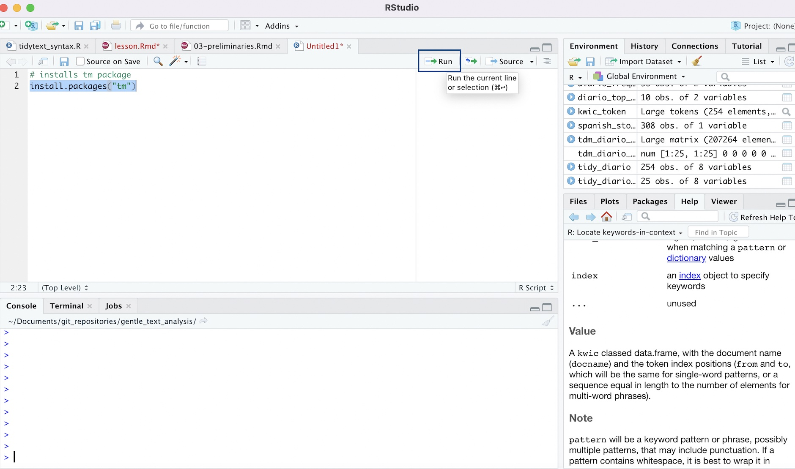

# Preliminaries: Getting Started with R Studio

In this preliminary section, we'll cover basic information that will help you to get started with R Studio. 

## R and R Studio Installation

If you haven't already, please go ahead and install R and R Studio. R and R Studio must be installed separately; you should install R first, and then R Studio. R is the bare-bones computing environment, while R Studio is a visually appealing and user-friendly interface that allows users to interact with this environment in an intuitive way. Once you have both installed, you don't need to open up R and R Studio separately; you only need to interact with R Studio (which will run R in the background). 

The following subsections provide instructions on installing R and R Studio for the macOS and Windows operating systems. These instructions are taken from the "Setup" section of the Data Carpentry Course entitled [*R for Social Scientists*](https://datacarpentry.org/r-socialsci/setup.html). The Data Carpentry page also contains installation instructions for the Linux operating system; if you're a Linux user, please refer to that page for instructions. 

The Appendix to Garret Grolemund's book *Hands on Programming with R* also provides an [excellent overview of the R and R Studio installation process]( [here](https://rstudio-education.github.io/hopr/). 

### Windows Installation Instructions

+ Download R from the [CRAN website](https://cran.r-project.org/bin/windows/base/)
+ Run the ```.exe``` file that was just downloaded.
+ Go to the [R Studio download page](https://www.rstudio.com/products/rstudio/download/#download) and under *Installers* select the "Windows" option.
+ Double click the file to install R Studio
+ Open R Studio to make sure it works. 

### macOS Installation Instructions

+ Download R from the [CRAN website](https://cran.r-project.org/bin/macosx/)
+ Select the ```.pkg``` file for the latest R version.
+ Double click on the downloaded file to install R.
+ It is also a good idea to install [XQuartz](https://www.xquartz.org/), which some packages require.
+ Go to the [R Studio download page](https://www.rstudio.com/products/rstudio/download/#download), and under *Installers* select the "macOS" option.
+ Double click the file to install R Studio
+ Open R Studio to make sure it works. 

## The R Studio Interface 

Now that we've installed and opened up R Studio, let's familiarize ourselves with the R Studio interface. When we open up R Studio, we'll see a window open that looks something like this:

```{r, echo=FALSE, results='asis', out.width='100%', fig.cap='The R Studio Interface', fig.alt='R Studio Interface Open on Desktop'}
knitr::include_graphics('pictures/rstudio_window_revised.png')
```

If your interface doesn't look exactly like this, it shouldn't be a problem; we would expect to see minor cosmetic differences in the appearance of the interface across operating systems and computers (based on how they're configured). However, you should see four distinct windows within the larger R Studio interface:

- The **top-left** window is known as the *Source*. 
  - The *Source* window is where we can write our R scripts (including the code associated with this tutorial), and execute those scripts. We can also type in R code into the "Console" window (bottom-left window), but it is preferable to write our code in a script within the source window. That's because scripts can be saved (while code written into the console cannot); writing scripts therefore allows us to keep track of what we're doing, and facilitates the reproducibility of our work. Note that in some cases, we may not see a *Source* window when we first open R Studio. In that case, to start a new script, simply click the ```File``` button on the R Studio menu bar, scroll down to ```New File``` button, and then select ```R Script``` from the menu bar that opens up.
  - It's also worth noting that the outputs of certain functions will appear in the *Source* window. In the context of our tutorial, when we want to view our datasets, we will use the ```View()``` function, which will display the relevant data within a new tab in the *Source* window. 
- The **top-right** window is the *Environment/History* pane of the R Studio interface. 
  - The "Environment" tab of this window provides information on the datasets we've loaded into R Studio, as well as objects we have defined (we'll talk about objects more later in the tutorial). 
  -The "History" tab of the window provides a record of the R commands we've run in a given session. 
- The **bottom-right** window is the *Files/Plots/Packages/Help/Viewer* window. 
  - The "Files" tab displays our computer's directories and file structures and allows us to navigate through them without having to leave the R environment. 
  - The "Plots" tab is the tab where we can view any visualizations (including maps) that we create. Within the "Plots" tab, make note of the "Zoom" button, which we can use to enlarge the display of our maps and visualizations if they're too compressed in the "Plots" window. Also, note the "Export" button within the "Plots" tab (next to the "Zoom" button); we can use this button to export the displayed map to a .png or .jpeg file that can be used outside of R Studio (we can also export our visualizations programmatically; we'll cover how to do so later in the tutorial).
  - The "Packages" tab provides information on which packages have been installed, as well as which packages are currently loaded (more on packages in Section 3.4)
  - The "Help" tab displays documentation for R packages and functions. If we want to know more about how a package or function work, we can simply type a "?" followed by the package or function's name (no space between the question mark and the name) and relevant information will be displayed within the "Help" tab. 
  - The "Viewer" tab displays HTML output. If we write code that generates an HTML file, we can view it within the "Viewer" tab. This will be relevant in the context of creating and viewing dynamic maps, which we'll cover in Section 4.7 of the tutorial. 
- The **bottom-left** window is the *Console/Terminal/Jobs* window. 
  - The "Console" tab is where we can see our code execute when we run our scripts, as well as certain outputs produced by those scripts. In addition, if there are any error or warning messages, they will be printed to the "Console" tab. We can also type code directly into the console, but as we noted earlier, it is better practice to write our code in a script and then run it from there. 
  - The "Terminal", "R Markdown" and "Jobs" tabs  are not relevant for the tutorial. 


## Install Packages 

R is an open-source programming language for statistical computing that allows users to carry out a wide range of data analysis and visualization tasks (among other things). One of the big advantages of using R is that it has a very large user community among social scientists and statisticians, who frequently publish R packages. One might think of packages as workbooks of sorts, which contain a well-integrated set of R functions, scripts, data, and documentation; these "workbooks" are designed to facilitate certain tasks or implement given procedures. These packages are then shared with the broader community, and at this point, anyone who needs to accomplish the tasks to which the package addresses itself can use the package in the context of their own projects. The ability to use published packages considerably simplifies the work of applied social scientists and digital humanists using R; it means that they rarely have to write code entirely from scratch, and can build on the code that others have published in the form of packages. This allows applied researchers to focus on substantive problems, without having to get too bogged down in complicated programming tasks. 

In the context of this tutorial, extracting even basic information from a text corpus in R would be a relatively complex task if we had to write all our code from scratch. However, because we are able to make use of text mining and visualization packages written by other researchers and programmers, the task is considerably simpler, and will not require any complicated programming. 

In this workshop, we will use the following packages to carry out some basic text mining and data visualization tasks (please click the relevant link to learn more about a given package; note that the tidyverse is not a single package, but rather an entire suite of packages used for common data science and analysis tasks): 

+ [*tm*](https://cran.r-project.org/web/packages/tm/vignettes/tm.pdf)
+ [*tidyverse*](https://www.tidyverse.org): 
+ [*wordcloud2*](https://cran.r-project.org/web/packages/wordcloud2/vignettes/wordcloud.html)
+ [*quanteda*](https://quanteda.io)
+ [*tidytext*](https://cran.r-project.org/web/packages/tidytext/vignettes/tidytext.html)

To install a package in R, we can use the ```install.packages``` function. A function is essentially a programming construct that takes a specified input, runs this input (called an "argument") through a set of procedures, and returns an output. In the code block below, the name of the package we want to install (here, "tm") is enclosed within quotation marks and placed within parentheses after printing ```install.packages``` Running the code below will effectively download the *tm* package to our computer:

```{r, eval=FALSE}
# Installs "tm" package
install.packages("tm")
```

To run this code in your own R session:

* First, copy the code from the codeblock above (you can copy the code to your clipboard by hovering over the top-right of the code-block and clicking the "copy" icon; you can also highlight the code and copy from the ```Edit``` menu of your browser). 
* Then, start a new R script within R Studio; if you want to keep a future record of your work, you may want to save this script to your computer (perhaps in the same folder to which you downloaded the tutorial data). We can save our scripts via the R Studio "File" menu.
* Paste the code into the script, highlight it, and click the "Run" button that is just above the *Source* window.
* Alternatively, instead of copying/pasting, you can manually type in the code from the codeblock into your script (manually typing in the code is slower, but often a better way to learn than copy/pasting). 
* After you've run the code, watch the code execute in the console, and look for a message confirming that the package has been successfully installed. 

Below, we can see how that line of code should look in your script, and how to run it:

```{r, echo=FALSE, results='asis', out.width='100%', fig.cap='Installing tm package in R Script'}

```

Please note that you can follow along with the tutorial on your own computers by transferring all of the subsequent codeblocks into your script in just this way. Run each codeblock in your R Studio environment as you go, and you should be able to replicate the entire tutorial on your computer. You can copy-paste the workshop code if you wish, but we recommend actually retyping the code into your script, since this will help you to more effectively familiarize yourself with the process of writing code in R.

Note that the codeblocks in the tutorial usually have a comment, prefaced by a hash ("#"). When writing code in R (or any other command-line interface) it is good practice to preface one's code with brief comments that describe what a block of code is doing. Writing these comments can allow someone else (or your future self) to read and quickly understand the code more easily than otherwise might be the case. The hash before the comment effectively tells R that the subsequent text is a comment, and should be ignored when running a script If one does not preface the comment with a hash, R wouldn't know to ignore the comment, and would throw an error message.

Now, let's install the other packages we mentioned above, using the same ```install.packages()``` function: 

```{r, eval=F}
install.packages(tidyverse)
install.packages(wordcloud2)
install.packages(quanteda)
install.packages(tidytext)
```

All of the packages we need are now installed!

## Load libraries

However, while our packages are installed, they are not yet ready to use. Before we can use our packages, we must load them into our environment. We can think of the process of loading installed packages into a current R environment as analogous to opening up an application on your phone or computer after it has been installed (even after an application has been installed, you can't use it until you open it!). To load (i.e. "open") an R package, we pass the name of the package we want to load as an argument to the ```library``` function. For example, if we want to load the *tm* package into the current environment, we can type:

```{r, eval=F}
# Loads tm package into memory
library(tm)
```

At this point, the full suite of the *tm* package's functionality is available for us to use. 

Now, let's go ahead and load the remainder of the packages that we'll need:

```{r, eval=F}
# loads remainder of required packages
library(tidyverse)
library(wordcloud2)
library(quanteda)
library(tidytext)
```

At this point, the packages are loaded and ready to go! One important thing to note regarding the installation and loading of packages is that we only have to install packages once; after a package is installed, there is no need to subsequently reinstall it. However, we must load the packages we need (using the ```library``` function) every time we open a new R session. In other words, if we were to close R Studio at this point and open it up later, we would **not** need to install these packages again, but **would** need to load the packages again.  


```{r, echo=F}
library(tm)
library(tidyverse)
library(wordcloud2)
library(quanteda)
library(tidytext)
```

## Set Working Directory 

Before we can bring our data into R Studio and begin the tutorial, we have to specify that data's location on our computer. This step is known as setting one's working directory. Before setting the working directory, make sure that you've downloaded the ICPSR dataset, and have placed it in a directory (i.e. folder) on your computer that is specifically dedicated to this tutorial. 

If you're unfamiliar with the concept of file paths, the easiest way to set your working directory is through the R Studio menu. To do so, follow these steps: 

+ First, Click on the "Session" menu on the R Studio menu bar at the top of your screen, and then scroll down to the "Set Working Directory" button in the menu that opens up. 
+ When you hover over the "Set Working Directory" button, a subsidiary menu that contains a button that says "Choose Directory" will open; click this "Choose Directory" button. 
+ In the dialog box that opens up, navigate to the directory that contains the ICPSR data, select it, and click "Open". At this point, your working directory should be set!

The graphic below demonstrates the process of setting one's working directory through R Studio's menus: 

```{r, echo=FALSE, results='asis', out.width='100%', fig.cap='Setting Working Directory Via Menus'}
knitr::include_graphics('pictures/setting_wd_revised.png')
```

**Alternatively**, if you are familiar with the concept of file paths, and know the file path to the folder containing the downloaded ICPSR dataset, you can set the working directly using the ```setwd()``` function, where the argument to the function is the relevant file path enclosed in quotation marks. For example, the following code sets the working directory to the folder containing the advertisements from the El Diario corpus: 

```{r, eval=F}
# Sets working directory 
setwd("019.11.14-ElDiarioCorpus/creatives")
```

Note that you won't want to copy and paste the above codeblock, since your file path will be different; be sure to replace the file path above with your own. 

# Reading in a Text Corpus

The first step in working with text data in R Studio is to load the data which you wish to analyze into your R environment.

Sometimes, you may only need to analyze the text within a single document, but often, you will want to analyze an entire collection of text documents (known as a corpus). In our case, we want to analyze a corpus comprised of text documents that are part of the "creatives" section of the broader "Diario" project. 

To load the files within this "creatives" directory into R Studio as a corpus, the first step is to read in all of the file names for the text documents that constitute the "creatives" corpus, and store these names within a character vector; a "vector" in R is simply a sequence of elements, and in the case of a character vector, those elements are text strings. 

The code below first reads in the file names from the "creatives" directory, using ```list.files(pattern=".txt")```. The ```list.files()``` function produces a character vector of files within a specified directory (if no directory is specified, it defaults to extracting the names of files from the working directory), and the argument to this function, ```pattern=".txt"```, specifies what type of files we want the ```list.files()``` function to extract (anything with a ".txt" extension). Finally, it assigns this vector of file names to a new object named ```diario_files```:

```{r, echo=-1}
setwd("2019.11.14-ElDiarioCorpus/creatives")
# reads in the filenames for diario advertisements as a character vector, and assigns it to an object named "diario_files"
diario_files<-list.files(pattern=".txt")
```

The concept of object assignment, which we alluded to above, is a fundamental concept when working in a scripting environment; indeed, the ability to easily assign values to objects is what allows us to easily manipulate and process our data in an intuitive manner within a given workflow. To better understand the mechanics of object assignment, let's briefly step away from our text data, and consider a simple example:

```{r}
# assign value 5 to new object named x
x<-5
```

In the code above, we use R's assignment operator, ```<-```, to assign the value 5 to an object named "x." Now that an object named "x" has been created and assigned the value 5, printing "x" in our console (or printing "x" in our script and running it) will return the value 5: 

More generally, the process of assignment effectively equates the output created by the code on the right side of the assignment operator (```<-```) to an object with a name that is specified on the left side of the assignment operator. Whenever we want to look at the contents of an object (i.e. the output created by the code to the right side of the assignment operator), we simply print the name of the object in the R console (or print the name and run it within a script). 

While the example above was very simple, we can assign virtually any R code, and by extension, the data structure(s) generated by that code (such as datasets, vectors, graphs/plots etc.) to an R object. Above, we assigned the vector of text file names created by ```list.files(pattern=".txt")``` to an object named ```diario_files```, and can now confirm that this vector is associated with the ```diario_files``` object by printing the object name:

```{r}
# prints contents of "diario_files" vector
diario_files
```

We will use this basic principle of object assignment throughout the lesson.

Now, let's use this vector of file names to create a Corpus that contains the text from all of these files. To do so, we'll use the *tm* package's ```Corpus()``` function. Below, the first argument to the ```Corpus()``` function, ```URISource(diario_files)```, specifies the file names of the text documents from which we want to create our corpus. The second argument, ```readerControl=list(reader=readPlain))```, specifies that we want the ```Corpus()``` function to use a plain text reader ("readPlain") to read in the text data within the documents specified in ```diario_files``` (if our files were in a different file format, we would use a different reader that is appropriate to that file format). Finally, we assign the corpus to a new object named ```diario_creatives_corpus```:

```{r, echo=-1}
setwd("2019.11.14-ElDiarioCorpus/creatives")
# Uses the "Corpus" function from the "tm" package to create a new text corpus based on the diario advertisement text files; this corpus is assigned to a new object named "diario_adverts_corpus"
diario_creatives_corpus<-Corpus(URISource(diario_files), readerControl = list(reader=readPlain))
```

If we print the name of our corpus object into the console (or run it from a script), we can return some basic metadata about the corpus we've just created:

```{r}
# prints metadata about the corpus assigned to the "diario_adverts_corpus" object
diario_creatives_corpus
```

# Creating a tidy dataframe from a text corpus

Once we we have created a text corpus out of the relevant collection of text documents in our directory, we can 

```{r}
# Uses the "tidy" function from the "tidytext" package to transform the "diario_adverts_corpus" corpus into a tidy data frame, where each file's textual information is stored as a row in the data frame; this data frame is assigned to a new object named "diario_adverts_tidy"
diario_creatives_tidy<-tidy(diario_creatives_corpus)
```

```{r, echo=F}
tidy_diario_head<-head(diario_creatives_tidy, 25)
```

```{r, eval=F}
# Prints the contents of "diario_creatives_tidy"
diario_creatives_tidy
```

```{r, echo=F}
tidy_diario_head %>% datatable(extensions=c("Scroller", "FixedColumns"), options = list(
  deferRender = TRUE,
  scrollY = 350,
  scrollX = 350,
  dom = "t",
  scroller = TRUE,
  fixedColumns = list(leftColumns = 1)
))
```

# Creating a word frequency table

```{r}
# extract Spanish stopwords as a data frame, and assign it to an object named "spanish stopwords"
spanish_stopwords<-as.data.frame(stopwords("spanish"))
```

```{r, message=F, warning=F}
# Creates word frequency table based on "text" column of "diario_adverts_tidy" object; the column containing a given word in the final output table is named "word"; the final output table is assigned to an object named "diario_frequency_table"
diario_frequency_table<-
  diario_creatives_tidy %>% # declares dataset with relevant text
    unnest_tokens(output=word, # specifies name of output column (i.e. "word")
                  input=text, # specifies name of input column containing text data
                  token="words") %>% # specifies unit for tokenizing
        count(word, sort=TRUE) %>% # counts frequency of each word in "word" column 
        filter(!word %in% stop_words$word) %>% # removes English stop words
        filter(!word %in% spanish_stopwords$`stopwords("spanish")`) # removes Spanish stopwords
```


```{r, message=F, warning=F}
# defines a vector that extracts numbers from the "word" column in "diario_frequency_table" and assigns it to a new object named "diario_frequency_table_numbers"
diario_frequency_table_numbers<-parse_number(diario_frequency_table$word)
```

```{r}
# updates the existing "diario_frequency_table" data frame by binding "diario_frequency_table_numbers" vector to it
diario_frequency_table<-cbind(diario_frequency_table, diario_frequency_table_numbers)
```

```{r}
# extracts all rows in which the "diario_frequency_table_numbers" column of the "diario_frequency_table" data frame is an NA value; this effectively removes all rows in "diario_frequency_table" in which the "word" column has a number
diario_frequency_table<-diario_frequency_table %>% 
                        filter(is.na(diario_frequency_table_numbers))
```

```{r}
# deletes the "diario_frequency_table_numbers" from the "diario_frequency_table" dataframe 
diario_frequency_table<-diario_frequency_table %>% 
                        select(-diario_frequency_table_numbers)
```

```{r, echo=F}
diario_frequency_table_head<-head(diario_frequency_table, 50)
```

```{r, eval=F}
# prints updated contents of "diario_frequency_table"
diario_frequency_table
```

```{r, echo=F}
diario_frequency_table_head %>% datatable(extensions=c("Scroller", "FixedColumns"), options = list(
  deferRender = TRUE,
  scrollY = 350,
  scrollX = 350,
  dom = "t",
  scroller = TRUE,
  fixedColumns = list(leftColumns = 1)
))
```

# Visualizing word frequency data

## Charting word frequencies

### Extracting dataframe of ten most frequent words

```{r}
# extracts ten most frequently appearing words from "diario_frequency_table" from "diario_frequency_table" and assigns this data frame to a new object named "diario_top_ten"
diario_top_ten<-diario_frequency_table %>% 
                slice_max(n, n=10)
```

```{r, eval=F}
# prints contents of "diario_top_ten"
diario_top_ten
```

```{r, echo=F}
diario_top_ten %>% datatable(extensions=c("Scroller", "FixedColumns"), options = list(
  deferRender = TRUE,
  scrollY = 350,
  scrollX = 350,
  dom = "t",
  scroller = TRUE,
  fixedColumns = list(leftColumns = 1)
))
```

### Using ggplot2 to make chart of ten most frequent words

```{r}
# Uses "diario_top_ten" data frame to make horizontal bar chart of ten most frequently used words in corpus, in descending order; the chart is assigned to a new object named "diario_frequency_graph"
diario_frequency_graph<-
  ggplot(diario_top_ten, aes(x=reorder(word, n), y=n))+
    geom_col()+
      coord_flip()+
      xlab("")+
      ylab("Frequency")+
      ggtitle("Ten Most Frequent Words in Diario Advertisements")+
      labs(caption = "Source: El Diario Project")
```

```{r}
# prints "diario_frequency_graph"
diario_frequency_graph
```

## Creating a word cloud

```{r}
# make word cloud based on word frequency information from "df_word_frequencies"
wordcloud2(data = diario_frequency_table, minRotation = 0, maxRotation = 0, ellipticity = 0.2)
```

# Bigrams

## Extracting bigrams from a text corpus

```{r, eval=F}
# Prints "diario_creatives_tidy"
diario_creatives_tidy
```

```{r, echo=F}
tidy_diario_head %>% datatable(extensions=c("Scroller", "FixedColumns"), options = list(
  deferRender = TRUE,
  scrollY = 350,
  scrollX = 350,
  dom = "t",
  scroller = TRUE,
  fixedColumns = list(leftColumns = 1)
))
```
\

```{r}
# Extracts table of bigram frequencies
diario_bigram<-diario_creatives_tidy %>% 
                  unnest_tokens(bigram, text, token="ngrams", n=2) %>% 
                  count(bigram, sort=TRUE)
```

```{r, echo=F}
diario_bigram_head<-head(diario_bigram, 25)
```

```{r, eval=F}
# prints "diario_bigram"
diario_bigram
```

```{r, echo=F}
diario_bigram_head %>% datatable(extensions=c("Scroller", "FixedColumns"), options = list(
  deferRender = TRUE,
  scrollY = 350,
  scrollX = 350,
  dom = "t",
  scroller = TRUE,
  fixedColumns = list(leftColumns = 1)
))
```
\

```{r, warning=F, message=F}
# Separates bigrams in the "bigram" column of "diario_bigram" into two separate columns, named "word1" and "word2"
diario_bigram_separated<-diario_bigram %>% 
                          separate(bigram, c("word1", "word2", sep=" "))
```


```{r}
# Removes English stopwords from the "word1" and "word2" columns
diario_bigram_filtered<-diario_bigram_separated %>% 
                            filter(!word1 %in% stop_words$word) %>%
                            filter(!word2 %in% stop_words$word) %>% 
                            filter(!word1 %in% spanish_stopwords$`stopwords("spanish")`) %>% 
                            filter(!word2 %in% spanish_stopwords$`stopwords("spanish")`)
```

remove numbers

```{r, message=F, warning=F}
# Extracts a vector of numbers contained in "word1" of "diario_bigram_filtered" and assigns it to a new object named "diario_bigram_word1numbers"
diario_bigram_word1numbers<-parse_number(diario_bigram_filtered$word1)
```

```{r, message=F, warning=F}
# Extracts a vector of numbers contained in "word2" of "diario_bigram_filtered", and assigns it to a new object named "diario_bigram_word2numbers"
diario_bigram_word2numbers<-parse_number(diario_bigram_filtered$word2)
```

```{r}
# Adds the "diario_bigram_word1numbers" and "diario_bigram_word2numbers" vectors as columns in "diario_bigram_filtered"
diario_bigram_filtered<-cbind(diario_bigram_filtered, diario_bigram_word1numbers, diario_bigram_word2numbers)
```


```{r}
# Extracts rows in "diario_bigram_filtered" where the "diario_bigram_word1numbers" or "diario_bigram_word2numbers" columns contain an NA value; this effectively deletes rows where the bigram contains a number
diario_bigram_filtered<-diario_bigram_filtered %>% 
                          filter(is.na(diario_bigram_word1numbers)) %>% 
                          filter(is.na(diario_bigram_word2numbers))
```

```{r}
# Takes separate words, in the "word1" and "word2" columns of "diario_bigram_filtered", and unites them back into one column, named "bigram"; this updated data frame is assigned to a new object named "diario_bigram_filtered_unite"
diario_bigram_filtered_unite<-diario_bigram_filtered %>% 
                                unite(bigram, word1, word2, sep=" ")
```

```{r, echo=F}
diario_bigram_filtered_unite_head<-head(diario_bigram_filtered_unite, 50)
```

```{r, eval=F}
# prints contents of "diario_bigram_filtered_unite"
diario_bigram_filtered_unite
```

```{r, echo=F}
diario_bigram_filtered_unite_head %>% datatable(extensions=c("Scroller", "FixedColumns"), options = list(
  deferRender = TRUE,
  scrollY = 350,
  scrollX = 350,
  dom = "t",
  scroller = TRUE,
  fixedColumns = list(leftColumns = 1)
))
```
\

```{r}
# removes the "diario_bigram_word1numbers" and "diario_bigram_word2numbers" columns from "diario_bigram_filtered_unite"
diario_bigram_filtered_unite<-diario_bigram_filtered_unite %>% 
                              select(-c(diario_bigram_word1numbers, diario_bigram_word2numbers))
```

```{r, eval=F}
# Prints updated contents of "diario_bigram_filtered_unite"
diario_bigram_filtered_unite
```

```{r, echo=F}
diario_bigram_filtered_unite_head2<-head(diario_bigram_filtered_unite, 50)
```

```{r, echo=F}
diario_bigram_filtered_unite_head2 %>% datatable(extensions=c("Scroller", "FixedColumns"), options = list(
  deferRender = TRUE,
  scrollY = 350,
  scrollX = 350,
  dom = "t",
  scroller = TRUE,
  fixedColumns = list(leftColumns = 1)
))
```


## Visualizing bigrams

```{r}
# Extracts a data frame of the ten most frequently occurring bigrams in "diario_bigram_filtered_unite" and assigns this data frame to a new object named "diario_bigram_top_ten"
diario_bigram_top_ten<-diario_bigram_filtered_unite %>% 
                        slice_max(n, n=10)
```

```{r, eval=F}
# Prints contents of "diario_bigram_top_ten"
diario_bigram_top_ten
```

```{r, echo=F}
diario_bigram_top_ten %>% datatable(extensions=c("Scroller", "FixedColumns"), options = list(
  deferRender = TRUE,
  scrollY = 350,
  scrollX = 350,
  dom = "t",
  scroller = TRUE,
  fixedColumns = list(leftColumns = 1)
))
```
\

```{r}
# Creates horizontal bar graph of ten most frequently appearing bigrams in the corpus, arrayed in descending order; the bar graph is assigned to a new object named "bigram_graph"
bigram_graph<-
  ggplot(diario_bigram_top_ten, aes(x=reorder(bigram, n), y=n))+
    geom_col()+
      coord_flip()+
      xlab("")+
      ylab("Frequency")+
      ggtitle("Ten Most Frequent Co-Occuring Words in Diario Advertisements")+
      labs(caption = "Source: El Diario Project")
```


```{r}
# prints "bigram_graph"
bigram_graph
```

# Extracting keywords in context

```{r}
# creates a tokens object based on the "text" column of the "tidy_diario" data frame and assigns it to "kwic_token"
kwic_token<-tokens(diario_creatives_tidy$text)
```

```{r}
# Extracts contextual text data for the keyword "business", based on a window of 3 words; the resulting data frame containing the contextual information associated with each appearance of the keyword is assigned to a new object named "business_keyword_context"
earth_keyword_context<-kwic(kwic_token, pattern="earth", valuetype="fixed", window=3)
```

```{r, eval=F}
# Prints contents of "business_keyword_context"
earth_keyword_context
```

```{r, echo=F}
business_keyword_context %>% datatable(extensions=c("Scroller", "FixedColumns"), options = list(
  deferRender = TRUE,
  scrollY = 350,
  scrollX = 350,
  dom = "t",
  scroller = TRUE,
  fixedColumns = list(leftColumns = 1)
))
```

# Further Reading


https://search.r-project.org/CRAN/refmans/quanteda/html/kwic.html


